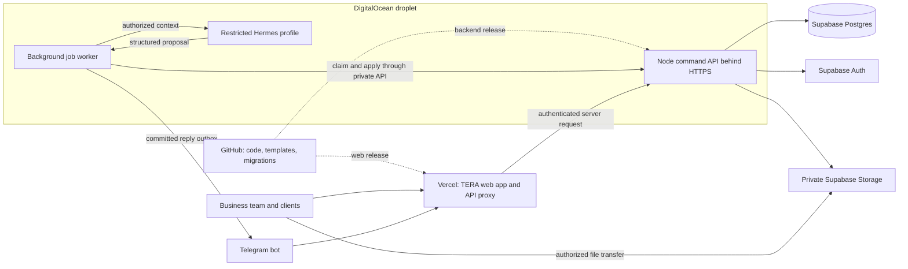

# TERA: reusable product template and hosting architecture

Architecture recommendation · 11 September 2026

This document maps the next implementation. The private source repository is [eyeamxela/tera](https://github.com/eyeamxela/tera). Vercel, Supabase, and the DigitalOcean runtime remain to be provisioned for this product. The existing public Sites link remains a session-only preview. The database-backed local application is the product foundation.

## 1. Product shape

TERA is one configurable application for project-based service businesses. A **business workspace** is our customer, such as a landscape practice or design studio. A **client** is that business's customer. A workspace contains its team, clients, projects, templates, rates, and integrations.

Preserve the organic-modern interface. Make **General project** the default. The standard navigation is Projects, Scope, Schedule & budget, Files & visuals, Updates, Client portal, and Team & settings. Specialist tools appear when the project template enables them.

| Shared product | Workspace configuration | Optional specialist modules |
| --- | --- | --- |
| Clients, projects, team assignments | Business name, logo, contact, preparer | Site plan and parcel lookup |
| Work packages and allowances | Currency, timezone, measurement units | Terrain and planting |
| Budget, phases, timeline | Standard service packages and actual rates | Rooms and finish schedules |
| Photos, drawings, reference gallery | Proposal language and section selection | Drawing register and permit references |
| Private updates and published revisions | Roles, publication policy, Telegram routing | Maintenance and recurring-care projections |
| Client review and project history | Default template | Industry-specific quantity calculators |

The first presets should be General, Landscape, and Design/remodel. Architecture can initially use General plus drawings and an authored service catalog. A full CAD/BIM editor, invoicing platform, or arbitrary workflow builder is outside this first product.

## 2. What the current code already provides

- Organization branding, a general/landscape project choice, manual work packages, private files, saved drafts, and client/team assignments.
- Server-calculated scopes and budget scenarios, optimistic edit concurrency, immutable published snapshots, revocable links, and identified client responses.
- A durable Telegram inbox, worker leases, restricted Hermes action contracts, and an outbound delivery log.
- A neutral general-project fixture, Courtyard Studio, alongside the landscape example.

These are local capabilities with production adapters. Live external integration tests remain outstanding.

The current implementation still requires land fields in every draft, exposes land navigation globally, uses USD/imperial conventions and a month-based landscape schedule, and has no saved service/rate catalog. Workspace selection is also single-business in practice. Renaming the brand alone does not resolve those dependencies.

## 3. Template and data model

Keep three distinct layers:

1. **Product code and authored templates in GitHub:** tested modules, component layouts, field definitions, allowed units, default sections, and versioned calculation rules.
2. **Business configuration in Postgres:** brand, owner/team, enabled templates, terms, actual service catalog, actual rates, and integration mappings. Secrets live in deployment secret stores.
3. **Project records in Postgres/private Storage:** copied work packages, inputs, files, draft history, published proposals, comments, and progress.

A package copied from the catalog becomes part of the project. Future catalog edits must not rewrite an earlier estimate. Published revisions freeze business presentation, template version, scope, calculated totals, timeline, assumptions, and file versions.

The attached `docs/workspace-template.example.json` is a proposed configuration shape, not a configuration file consumed by the current app.

Core schema changes:

- Replace the two-value template switch with a validated `templateId` and `templateVersion` registry.
- Make `ScopeItem` the common pricing record: description, quantity, unit, rate/allowance status, inclusion, ordering, phase, exclusions, and catalog provenance.
- Keep geometry and survey/source metadata as optional measurement evidence linked to a scope item.
- Move scale, spacing, acreage, planting priority, and care inputs into a landscape extension.
- Add explicit phases and scheduling rules; short service jobs can use days/weeks without inheriting a five-year landscape projection.
- Store currency with each scope. Define minor-unit money and decimal-quantity rounding before supporting currencies beyond the initial USD pilot.
- Separate an unknown rate from an explicitly approved zero-price item. Missing prices should produce a question or a clearly identified allowance.
- Keep planned, approved, and actual cost/progress separate. A budget change affects funded work and its forecast; it cannot prove appreciation, revenue, yield, or return on investment.

Module selection affects forms, navigation, validation, calculations, assistant context, and proposal sections. Hiding a tab is insufficient to disable a capability. Existing project data remains available if a default template changes; old published revisions retain their original template version.

## 4. Recommended hosting

Use GitHub + Next.js on Vercel + Supabase + a DigitalOcean droplet running the existing Node API, background worker, and dedicated Hermes runtime.



| Service | Responsibility |
| --- | --- |
| GitHub | Source history, tests, generic templates, schema migrations, release configuration |
| Vercel | Next.js UI, client URLs, short same-origin API proxy requests, preview deployments |
| Supabase | Durable Postgres records, verified email identity, private file objects |
| DigitalOcean | Always-running Node API and job worker, Hermes process, optional later terrain/export jobs |
| Hermes | Interpret notes and prepare structured proposals using authorized context |

This topology preserves the existing transaction and permissions layer. The droplet worker has no reason to edit the application repository when a client sends a field note. It calls the application API, which updates the database.

Vercel supports Next.js directly and GitHub-driven preview/production deployment. The current Vinext/Cloudflare output needs an explicit port; a `vercel.json` alone does not perform that migration. [Next.js on Vercel](https://vercel.com/docs/frameworks/full-stack/nextjs), [GitHub integration](https://vercel.com/docs/git/vercel-for-github)

## 5. Vercel migration requirements

Start from the database-backed `land-scope-ui` source. Keep the public demo release as a separate reference while migrating.

1. Replace Vinext build/dev commands with a pinned compatible Next.js toolchain, preserving React components, styles, routes, and domain calculations. Remove production dependence on Sites/Cloudflare plugins and update framework types.
2. Replace `cloudflare:workers` environment imports in the TERA proxy and site-assessment route. Replace `import.meta.env.DEV` with explicit deployment-mode handling.
3. Retain the browser-facing `/api/build/*` origin. Forward host-only session cookies and `Set-Cookie` correctly, maintain no-store responses, and keep the proxy credential server-only.
4. Replace the `CF-Connecting-IP` assumption with a verified Vercel client-IP source. The current fallback groups users under `local`; carrying it into production would break per-source sign-in throttling.
5. Configure the exact application origin for production and a separate staging deployment. The current API accepts one exact `BUILD_APP_ORIGIN`. Do not trust arbitrary preview hosts or route pull-request previews into production data.
6. Change file transfers before claiming upload compatibility. Current files can reach 10 MB. Vercel Functions document a 4.5 MB request/response limit, so both upload and download proxying need attention. [Function limits](https://vercel.com/docs/functions/limitations)

For files, the API authorizes a project-scoped upload intent and random object key. The browser transfers directly to private Storage. A finalize command checks object existence, allowed MIME/size, intended project, current membership, and completion before exposing a file record. Enforce bucket limits too; browser-reported metadata is not authoritative. Use fresh object keys rather than overwriting proposal attachments. Supabase supports signed uploads and recommends resumable uploads for files above 6 MB. [Signed uploads](https://supabase.com/docs/reference/javascript/file-buckets-uploadtosignedurl), [upload guidance](https://supabase.com/docs/guides/storage/uploads/standard-uploads)

For downloads, check project or published-revision access before issuing a short-lived private URL. A previously issued URL can remain valid until it expires, so specify a short lifetime and test that revocation prevents new URLs. If immediate revocation is required, stream through the authorized droplet endpoint instead of relying on a still-valid storage URL.

Keep long-running inference, retries, and exports in the existing worker. The web request records or reads work and returns promptly. Vercel's bounded function lifetime is another reason to keep this worker independent. [Function execution limits](https://vercel.com/docs/functions/limitations)

## 6. Telegram → Hermes → dashboard

1. A team member sends text, a voice note, or a photo to the business's bot.
2. Telegram calls the configured webhook. Keep the current web-proxy-to-API route initially so its authentication boundary remains intact.
3. The API verifies the webhook secret, numeric sender, active business membership, and chat/topic/project route. It saves the incoming event before acknowledging it.
4. A worker claims the job. Voice transcription is a separately configured step; photos remain attachments until a verified vision/OCR path is implemented.
5. The API supplies only that member's authorized project context. The worker sends it to the business's restricted Hermes profile with a persisted request and stable idempotency key.
6. Hermes returns `capture_update`, `propose_scope`, or `needs_input`. The API rechecks permission and draft version, calculates totals, then commits the accepted action.
7. The outbox records any reply. “Saved” follows a committed action; uncertain outbound delivery is surfaced rather than blindly retried.
8. The dashboard reads current records. Add revision-aware refresh on focus and lightweight polling for the beta. Preserve unsaved local edits; real-time subscriptions can follow later.

Use one consumer for each bot's inbound updates. Do not enable both the app webhook and Hermes native Telegram polling for the same token. Publishing a proposal remains an explicit owner action; a future Telegram confirmation can refer to the exact reviewed revision.

Hermes documents authenticated loopback API serving, runs/status endpoints, durable idempotent submission, and independent profiles. Pin the deployed release and verify those contracts. A profile separates agent state; OS/container permissions and restricted credentials must enforce the production boundary. [Hermes API](https://hermes-agent.nousresearch.com/docs/user-guide/features/api-server), [Hermes profiles](https://hermes-agent.nousresearch.com/docs/user-guide/profiles/)

Hermes receives no database, storage-service, deployment, or Telegram sending credentials. The API owns business writes; the worker owns transport. Proposal approvals are recorded client feedback, not an implemented e-signature service.

## 7. One codebase, staged business isolation

**First pilot:** one business deployment, one Vercel app, one Supabase project, one droplet, one dedicated bot and Hermes profile. This matches the current runtime assumptions.

**Early additional businesses:** deploy the same tested release with separate configuration and credentials. A dedicated stack per business is the simplest isolation path before shared-SaaS work is complete. Avoid long-lived client source forks. If several processes share a droplet, use separate service identities or containers and separate Hermes homes; shared infrastructure still creates a common failure boundary.

**Shared SaaS later:** one application can serve multiple businesses, but it requires explicit active-workspace selection, verified hostname/workspace mapping, multi-membership login, per-tenant bot/worker credentials, file isolation, and cross-tenant access tests. The current first-membership selection and one-organization bootstrap are not sufficient. Do not route tenant context from an unchecked hostname or model-provided ID.

Keep `organizationId` in every business-owned record now. A client-facing share token resolves to a published project inside one business. Neither a Telegram group member nor possession of a client link grants access to all business records.

## 8. Repository and release logic

Use one private GitHub product repository. The existing root structure is enough; no monorepo tooling is required initially:

```text
app/                  Next.js screens, client portal, thin API routes
components/           Shared UI
server/               Command API, permissions, calculations, job worker
templates/            Authored general/landscape/design definitions
supabase/migrations/  Versioned database schema
deploy/               Droplet services, HTTPS config, release instructions
tests/                Domain, permissions, integration and recovery checks
docs/                 Architecture and onboarding contract
```

Only generic examples belong in source. Private client projects, photographs, quotes, live databases, transcripts, `.env` files, and Hermes state stay out of Git.

Code release: branch → checks → isolated staging → reviewed merge → Vercel web deployment and an explicit backend release from the same source revision. Vercel's GitHub integration provides preview URLs and production-branch deployments. Configure staging and production environment values separately. [GitHub deployment behavior](https://vercel.com/docs/git/vercel-for-github), [environment separation](https://vercel.com/docs/environment-variables)

The droplet needs its own deployment procedure; a GitHub push or Vercel deployment does not update a running Node/Hermes process automatically. Use versioned release directories, `npm ci` against the lockfile, health checks, and systemd restarts. Apply backwards-compatible migrations once under a migration lock, then update API/worker before a UI release that needs the new contract. Keep the previous application release for rollback; database changes need their own forward/restore plan.

Project update: browser/Telegram → API transaction → database → UI refresh. No build pipeline runs. Template/rate changes create new project defaults; publication produces a fixed client revision.

Droplet setup should use SSH keys, a non-root service account, restricted inbound ports, service supervision, backups, and monitoring. Keep the Node and Hermes listeners on loopback, exposing only the required HTTPS routes. [DigitalOcean setup](https://docs.digitalocean.com/products/droplets/getting-started/recommended-droplet-setup/)

## 9. Implementation order and proof

| Step | Deliverable | Acceptance |
| --- | --- | --- |
| 1 | True general schema and template registry | General project has no required acres, planting, or care fields; both general and landscape fixtures work |
| 2 | Saved service catalog and neutral proposal | A business copies its packages into a project; changing catalog rates leaves old quotes unchanged |
| 3 | Next.js/Vercel staging port and file-transfer changes | Login, drafts, 10 MB private upload/download, revoked access, and client revision review work from a separate device |
| 4 | One live business stack | Production auth/email, Postgres/Storage, API, worker, and restricted Hermes pass live health and access tests |
| 5 | Telegram pilot | Text/voice → saved update → priced draft → reviewed publication → client response; duplicate events and restarts do not duplicate writes |
| 6 | Second business | Separate deployment or completed multi-tenant routing; attempts to cross business/file/job boundaries fail |

The first business setup needs name/logo/contact, owner email, selected template, currency/timezone/units, initial services and rates, team/project assignments, a first client/project, and Telegram routing. Infrastructure setup needs the chosen GitHub owner, Vercel team, domain, Supabase project, droplet, bot, email sender, and model/transcription configuration. Provider credentials should be entered through the relevant secret stores.

The next coding milestone is Steps 1–2, preserving the current UI. The Vercel port follows as an isolated staging migration; replacing the live public demo is a separate release action.
