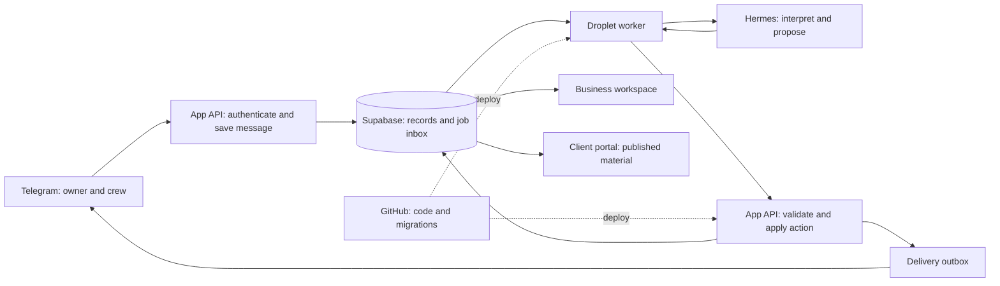

# TERA — production beta specification

Date: 11 September 2026. Status: proposed build specification; infrastructure and integrations have not been provisioned. Pilot: Connor / Ojai Permaculture. Preserve the current clean, organic-modern interface.

## 1. Product definition

A project CRM for businesses that design, build, or care for physical places. The business speaks or sends photos through Telegram; the application turns that input into organized project records, draft scopes, progress updates, and a clear client portal.

The reusable product is **client → project → modular scope → published proposal → delivery updates**. Ojai Permaculture supplies the first service template, rate book, terminology, and land-planning tools. Architecture, interiors, remodeling, and tree care can later use the same records with different work packages. Start with one real business and a few real projects before building self-service onboarding for other companies.

## 2. Recommended stack

| Layer                    | Beta choice                                                                    | Responsibility                                                                   |
| ------------------------ | ------------------------------------------------------------------------------ | -------------------------------------------------------------------------------- |
| Web application          | Existing React / TypeScript interface and server routes                        | Business workspace and client portal; one shared command API                     |
| Production hosting       | Cloudflare Workers, subject to a deployment/authentication compatibility check | Host the existing Workers-oriented application on a production domain            |
| Records, identity, files | Managed Supabase: Postgres, Auth, Storage                                      | Durable CRM records, team/client sign-in, private photos and documents           |
| Field interface          | One dedicated Telegram bot for Ojai                                            | Voice, text, photos, project selection, actionable replies                       |
| Assistant runtime        | One DigitalOcean droplet running Hermes and a small worker                     | Interpret requests, prepare structured changes, process queued work              |
| Source control           | GitHub                                                                         | Application code, migrations, service templates, tests, deployment configuration |

The current application already builds for Workers. Cloudflare identifies Workers as Vinext's primary deployment target; verify the installed version and authentication behavior before a production release. The existing owner-private Sites preview is a design reference, not proof that an outside client can open their project. Production access needs an explicit hosting/authentication setup and an external-client acceptance test. [Vinext](https://github.com/cloudflare/vinext)

Supabase combines the database with identity and file access policies. The application must still define and test who can access each company's projects. [Database access](https://supabase.com/docs/guides/database/postgres/row-level-security), [file access](https://supabase.com/docs/guides/storage/security/access-control)

GitHub does not hold the live CRM database. A project update is a database write and appears on the next dashboard refresh; it requires no commit or deployment. Schema migrations are versioned with the code. Customer files go in private object storage. [Database migrations](https://supabase.com/docs/guides/deployment/database-migrations)

Use managed database services for the beta; operating Postgres, backups, file storage, and authentication on the Hermes droplet would add administration. The recurring cost categories are web hosting, Supabase, the droplet, model/transcription usage, and transactional email. This specification makes no current-price or usage-volume estimate.

## 3. Runtime flow

Use a small **Telegram webhook receiver in the application API** as the durable entry point. Save the incoming message before acknowledging it, then let the droplet worker process it. This keeps field capture available when Hermes restarts. Telegram provides webhook authentication and unique update IDs; its webhook retries and retention are finite, so the application's own inbox is essential. [Telegram Bot API](https://core.telegram.org/bots/api)

Run Hermes's authenticated API on the droplet's loopback interface. Before submission, the worker persists the exact request and a stable Hermes `Idempotency-Key`; it then submits the job, records its run identifier, and retrieves its result. After an uncertain response, reuse that key with the identical request and reconcile the existing attempt before creating another. Hermes documents a programmatic Runs API; pin and check the installed runtime's capabilities before depending on it. The CRM keeps its own durable job state regardless of Hermes run retention. [Hermes API](https://hermes-agent.nousresearch.com/docs/user-guide/features/api-server), [integration guide](https://hermes-agent.nousresearch.com/docs/developer-guide/programmatic-integration)

Only the webhook receiver consumes this bot's inbound updates. Do not simultaneously enable Hermes's native Telegram polling for the same token. Native Telegram support is useful for personal assistants, but native chat history is not the application's durable inbox or permission system.

For the first beta, Hermes receives the authorized project context and returns a structured action proposal. The worker submits that proposal to the command API. This avoids giving the model database credentials or making model-written identity fields authoritative. Ordinary project reads and writes remain available through the web application if the assistant is unavailable.

## 4. The everyday workflow

1. Connor says: “Start a project for the Oak View client. They want orchard planting first, with pond work as a later option.” The bot finds an existing client or asks for the minimum missing details and creates the project.
2. Connor selects that project and sends a voice note, photos, and quantities. The original input, transcript, author, and capture time are retained with the resulting update.
3. “Build a first-phase scope for 40 trees using our standard planting package.” The assistant prepares work items using Connor's rate book. Unknown prices remain visibly unresolved.
4. Connor reviews scope, budget, timing, exclusions, and optional work in Telegram or the existing web layout.
5. The owner reviews and publishes in the web UI. The API freezes the client document and returns its web link. Copying the link is the beta default; automatic delivery requires an explicitly selected supported recipient/channel.
6. The client opens the portal, reviews drawings/photos, scope packages, price, sequence, and assumptions, then comments, requests changes, or approves a specific revision.
7. An assigned crew member sends “Orchard planting: 12 trees completed today” with photos. The internal project log updates. The appropriate person can publish a client-facing progress update.

Avoid asking staff to repeat the project name every time. Start with direct messages and a visible selected-project label. Later, map each approved team chat/topic to one project. Ambiguous references prompt a short choice before any project write.

## 5. Modular scopes and investment planning

Each scope contains ordered work packages. A package contains a title, description, location/zone, quantities and units, rate or allowance, inclusions, exclusions, prerequisites, duration/window, and supporting files. Items may be required, optional, deferred, or excluded. Store dependencies explicitly.

| Business template      | Example packages                                           | Optional specialist data                    |
| ---------------------- | ---------------------------------------------------------- | ------------------------------------------- |
| Ojai Permaculture      | Site assessment, water works, orchard, access, maintenance | Parcel, contours, mapped features, spacing  |
| Tree care              | Assessment, pruning, removal, disposal                     | Tree inventory and marked photographs       |
| Interior design        | Concept, room package, sourcing, installation              | Rooms, finish schedules, reference boards   |
| Remodel / construction | Survey, demolition, structure, finishes                    | Drawings, permits, subcontractor allowances |

A package is a reusable template copied into a project. Later template/rate-book edits do not retroactively change a quote. Use configurable fields and a few authored templates, without introducing a template marketplace or arbitrary workflow builder.

Budget and time scenarios operate on the same scope: changing funding, phase order, options, or installation window recalculates what can be delivered and when. Server-side calculation produces totals; the model supplies explanations. Maintain separate planned, approved, and actual values when field costs are introduced. Financial return, crop yield, appreciation, and biological outcomes are not automatically inferred from expenditure.

Retain the current Ojai cost/phase model as the first calculator. Generalize only its work-item/phase interface; other templates may need their own scheduling rules. Store money in currency minor units, use explicit decimal quantity/rounding rules, and reject missing rates at publication unless deliberately labeled as allowances or unpriced exclusions.

## 6. One client link, explicit revisions

Use a stable project share link that resolves to the latest **published** revision. Each revision also has its own permanent identifier and immutable snapshot of scope, prices, dates, assumptions, and referenced file versions. Keep prior revisions accessible to authorized viewers. A new draft never replaces published content automatically.

Beta viewing can use a high-entropy, revocable proposal link. Possession grants access to the intentionally shared proposal; it does not prove the holder's identity. Store a hash of the token, support expiry/revocation, avoid third-party scripts on that route, and deliver only approved files through short-lived access URLs. Private workspace data is never included in its payload.

For comments and approvals, verify the named client's email through a magic link or one-time code. Supabase supplies passwordless email sign-in; production email delivery must be configured and tested. [Passwordless authentication](https://supabase.com/docs/guides/auth/auth-email-passwordless)

Approval records bind the verified client, exact revision, scope snapshot hash, and timestamp. A later revision starts a new review state; prior approval remains history. Treat this as recorded proposal approval, not an implemented legal e-signature system.

Client requests to change budget, options, or timing create a proposed change. They do not overwrite the accepted scope. Published progress updates form a separate stream so sharing a site photo does not revise the contract amount.

## 7. Minimum records and permissions

| Record group                                    | Minimum contents                                                               |
| ----------------------------------------------- | ------------------------------------------------------------------------------ |
| Organization and memberships                    | Business identity, branding, owner/staff role, active membership               |
| Clients and contacts                            | Name, contact channels, verified client identity                               |
| Projects and project members                    | Client, address/site or rooms, stage, assigned team                            |
| Scope drafts and revisions                      | Packages/items, phases, assumptions, totals, draft version, published snapshot |
| Service templates and rate book                 | Reusable package definitions and effective versions                            |
| Updates and files                               | Author, project, source, visibility, storage reference, file version           |
| Shares, comments, approvals                     | Access token hash, expiry/revocation, exact revision and actor                 |
| Telegram identities and routes                  | Numeric sender ID, business member, approved chat/topic/project mapping        |
| Inbound messages, jobs, action receipts, outbox | Delivery identity, status, retries, result, traceable applied action           |

Every company-owned record carries an organization ID. The server derives identity from a verified login or trusted inbound message, then checks current membership and project assignment. Enable RLS and deny direct browser database access. The trusted API database role performs organization and assignment checks on every command; clients never receive that credential. The browser and the model cannot select a different acting user by editing request fields.

Start with three business roles: owner controls rates, publishing, and memberships; project lead manages assigned drafts and updates; crew adds field updates and attachments to assigned projects. Clients see published material for their projects and can respond to those revisions. Individual crew do not automatically inherit access to every project by joining a Telegram group.

For beta, use one dedicated Hermes runtime/profile and bot for Ojai. Do not mix another business into the same unrestricted assistant memory. Supporting a second business requires verifying database/file isolation and giving it separately scoped runtime credentials and context.

## 8. The small integration we need to build

The Cloudflare UI proxies to a small Node API on the droplet. This keeps the same Postgres interface in local PGlite and managed production Postgres, with one place for transactions, authentication, and private files. One application command layer supports the web UI and the worker: create a project, capture an update, attach a file, propose scope edits, calculate/preview, publish a revision, and record client feedback. Inputs have explicit schemas; writes check permission, project, expected draft version, and a server-issued action identity. Publication is a database transaction.

The bot adapter must validate Telegram's webhook secret, identify the numeric sender from the actual payload, store messages with a unique `(bot_id, update_id)`, and map the sender to a current member. Unauthorized messages are rejected or recorded as rejected without a CRM action. Persist accepted input before returning success. Treat edited messages as new events, not instructions to silently undo an earlier applied action.

The droplet worker claims jobs through the application API with expiring leases. It downloads permitted attachments, stores them privately, and transcribes voice notes through a configured transcription provider. The first Runs integration submits text and keeps photographs as project attachments: the documented Runs input is a string. Inline image input belongs to other documented API endpoints and needs its own verified integration before promising automatic photo interpretation. Do not assume voice files or PDFs can be uploaded directly to the Runs API; larger drawings can be uploaded through the portal and linked to the job.

The worker supplies only permitted project context. The model returns a validated action proposal or a request for clarification. CRM authorization runs again at execution time. Use the dedicated assistant configuration to restrict tools; a skill prompt alone is not an access-control mechanism.

For a minimal implementation, process one assistant job at a time per business and use per-project concurrency checks. Persist action IDs and receipts so a retry returns the original outcome. Do not rely solely on Hermes's idempotency window to prevent duplicate CRM writes. Draft conflicts require a refreshed preview rather than overwriting another person's changes.

Persist outbound acknowledgements and their delivery status separately. “Saved” is sent only after the CRM transaction succeeds. Telegram does not supply application-wide exactly-once delivery for outgoing messages: uncertain sends must be visible, and delivery receipts should prevent blind retries where possible. “Received” and “Saved” are distinct states.

Automation policy: routine internal captures can apply immediately. Pricing edits can prepare a draft automatically. Publishing, changing an approved scope, deleting project material, and sending a proposal to a client require an explicit authorized action bound to the concrete revision/recipient. Telegram confirmation buttons can make this one tap. A client's uploaded document cannot grant those permissions.

Use Postgres job/outbox tables for the pilot. A separate queue service, vector database, multi-agent fleet, or workflow automation product is unnecessary for this initial flow.

## 9. Reuse from the prototype

Inspected files: `app/page.tsx`, `app/data.ts`, `app/plan-model.ts`, `README.md`, `package.json`, and `.openai/hosting.json`.

| Existing surface                | Production work                                                                     |
| ------------------------------- | ----------------------------------------------------------------------------------- |
| Client and project screens      | Replace root component's in-memory records with authenticated API queries/mutations |
| Scope, measurement, planning UI | Persist inputs and run authoritative calculation/validation on the server           |
| Shared client snapshot          | Store immutable revisions and implement real per-project share routes               |
| Comments, approvals, activity   | Persist structured events with actual identity and authorization                    |
| Photos and drawings             | Store private objects; retain file versions referenced by proposals                 |
| Ojai parcel and terrain lookups | Keep optional; persist source metadata and assessment versions                      |
| Organic-modern presentation     | Preserve visual design while wiring durable state                                   |

Implementation status (September 11, 2026): the UI now saves through the Node command API to local PGlite Postgres. Authenticated local test identities, normalized records, private files, immutable revisions, real local client links, client responses, and a durable worker inbox/outbox are implemented. Production adapters exist for Supabase Auth/Postgres/Storage and Hermes/Telegram; their external connections are not provisioned or live-verified. D1/R2 remain unused. The README documents live read-only GIS integrations separately. Legal/buildable area remains unverified, and generated reference images are not site-specific engineering outputs. This specification adds no new entitlement or measurement claims.

## 10. Build order and acceptance gates

| Stage                    | Deliverable                                                                             | Done when                                                                                                                                           |
| ------------------------ | --------------------------------------------------------------------------------------- | --------------------------------------------------------------------------------------------------------------------------------------------------- |
| 1. Durable application   | Supabase schema/auth/storage, shared command API, current UI connected                  | Two staff users can work on assigned projects; records survive reload; cross-project/company access checks fail as expected                         |
| 2. Real client proposal  | Stable share route, immutable revisions, client verification/comments/approval          | An external client opens a real project; unpublished changes remain private; approval binds the exact revision                                      |
| 3. Telegram field loop   | Dedicated bot, durable webhook, worker, Hermes interpretation, text/voice/photo capture | Connor creates or updates a project from Telegram and receives a saved record link; duplicate input and worker restart do not duplicate CRM actions |
| 4. Modular scoping pilot | Ojai package/rate book, generated drafts, scenarios, team updates, publish confirmation | A real estimate goes from field note to reviewed proposal, client response, and crew progress using the same records                                |

Before Stage 3 implementation, run a short Hermes integration check: pinned runtime exposes the documented Runs endpoints, required content forms work, tool restrictions apply, and restart/retry behavior matches the worker design. Native Telegram hooks should not be assumed to guarantee persistence before platform acknowledgement.

Before inviting real clients, verify private file access, revoked links, expired memberships, stale-revision publishing, duplicate events, delayed/failed model jobs, and database plus object-storage restore. These are targeted checks for this workflow, not a claim of completed production validation.

The first complete pilot should be one owner, one crew member, one real client, and one project: **voice note → saved update → priced draft → published link → client response → field progress**. Avoid adding invoicing, payment processing, full accounting, mass marketing, automated permit decisions, BIM/CAD authoring, or additional industries until that loop works reliably.

## 11. Inputs for implementation

Use the landscape workflow as the first template. The product is TERA, with configurable business name and preparer, plus a general project template for design, construction, and other services. Implementation will need Connor's actual rate book and scope wording, a dedicated Telegram bot, a chosen production domain, Supabase and droplet environments, model/transcription configuration, email delivery, and named pilot participants. Those are setup inputs, not reasons to redesign the UI or build a generic CRM platform first.

Code is implemented and tested locally; see README.md and VALIDATION.md for exact verification. No production accounts, droplet, recurring service, public deployment, external client messages, or GitHub push were created in this build.

Source-control update (September 12, 2026): the private repository is https://github.com/eyeamxela/tera. `main` holds the full local CRM and `mobile-public-preview` holds the separately published demo. Production infrastructure and live integration acceptance remain outstanding.
