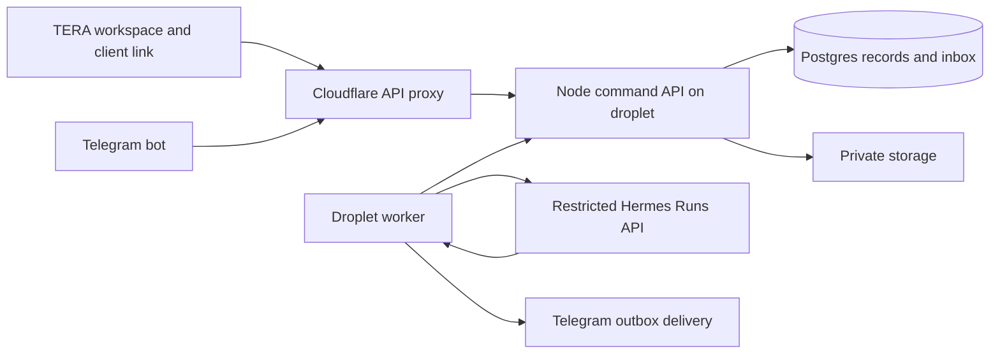

# TERA

A client workspace for scopes, plans, budgets, files, and field updates. The clean paper-and-olive interface is retained from the landscape prototype. Business name and preparer are configurable; landscape and general project templates use the same saved records.

TERA is the product name, replacing Build. Existing technical identifiers such as `BUILD_*`, `/api/build/*`, service names, and storage paths remain unchanged for compatibility. The separately published Sites preview now uses TERA branding (version 7); it remains a session-only demo without this CRM backend.

**Working local beta.** Production adapters exist for Supabase, Telegram, and Hermes; their external connections still need configuration and live verification. The hosted preview has been republished with TERA branding. This database-backed CRM has not been deployed.

## Source repository

Private repository: [eyeamxela/tera](https://github.com/eyeamxela/tera).

- `main`: the full TERA CRM, backend, migrations, tests, and hosting plan.
- `mobile-public-preview`: the source of the published session-only demo.

GitHub stores application source. Vercel and the production database/droplet connections are not configured yet; pushing code does not deploy the CRM.

## Run locally

Requires Node 22.13+ and npm:

```sh
npm ci
npm run dev:all
```

Open http://localhost:3000. Choose **Morgan · Owner** for the full workspace. Taylor is a project lead, Riley is crew, and Alex is the invited client for the example landscape project. Fixture logins exist only in explicit local mode; newly invited emails require the production email adapter.

`dev:all` starts the UI on 3000 and API on 4311, defaulting to local mode. Postgres data, files, and the share-signing secret persist in ignored `.build-local/`. Keep that directory out of Git and off public file servers. Its secret preserves existing share URLs.

```sh
npm test
npm run check
npm run build
```

For separate terminals: `BUILD_MODE=local npm run dev:api` and `npm run dev`. The UI command alone does not start the CRM API. Copy `.env.example` to `.env.local` only when configuring optional local adapters.

## Stack

| Layer         | Implementation                                                                 |
| ------------- | ------------------------------------------------------------------------------ |
| Interface     | React 19, TypeScript, Vinext/Vite, existing Sites-compatible Cloudflare Worker |
| Browser API   | `/api/build/*` Worker proxy; server-only production proxy credential           |
| Command API   | Node HTTP and Zod; shared permission and transaction layer                     |
| Database      | PGlite Postgres locally; `pg` with managed Supabase Postgres in production     |
| Identity      | Explicit local test sessions; verified Supabase email OTP in production        |
| Files         | Private filesystem locally; private Supabase Storage in production             |
| Assistant     | Dedicated restricted Hermes Runs API profile on the droplet                    |
| Field capture | Telegram webhook, Postgres job leases, worker, delivery outbox                 |
| GitHub        | Code, tests, migrations, and deployment configuration; never live CRM data     |



The first production deployment is one business workspace, dedicated bot, and organization-scoped worker. Composite keys and organization checks exist, but this is not a self-service multi-company SaaS launch. A person has one active staff workspace. Verify isolated runtime credentials and database/file access before adding a second business.

## Working workflow

1. Create a **general** or **landscape** project with its client and location.
2. Add modular work packages with quantity, unit, rate, description, and inclusion. Landscape jobs can also use mapped polygons, paths, calibrated imagery, and planting spacing.
3. Adjust budget, delivery window, and contingency. The deterministic model funds whole packages in order and distributes delivery across the chosen window. Landscape projects add separate tree-care allowances.
4. Upload private files. Select the documents to include in the next published proposal. A published plan's aerial is also accessible through that proposal link.
5. Edits save automatically. Draft-version checks reject conflicting saves. A failed save remains visible; retry transport failures or reload the saved copy to resolve conflicts.
6. The owner reviews and publishes a fixed revision at a stable client URL. The portal shows the latest published revision and a revision picker. Publishing does not send a message.
7. An invited client verifies their email to comment, approve, or request changes. Responses record the exact revision/hash without rewriting the document. This is project feedback, not an e-signature system.
8. Crew capture internal updates and files. Owners/leads choose whether their updates appear in the client timeline. Reload to see another staff member's changes; live subscriptions are deferred.

Team & setup supports business branding, adding leads/crew by email, project assignments, client grants, staff access removal, link revocation, Telegram sender/chat/topic routing, and inbox status. These setup forms do not send invitation emails.

## Permissions and durable records

Migrations create organizations, people, memberships, project assignments, projects, versioned drafts, immutable published revisions, client grants, hashed share tokens, private files, updates, responses, action receipts, sessions, Telegram mappings, jobs, and outbox records.

- Owners manage and publish. Leads edit assigned drafts and client updates. Crew upload files and record internal updates on assigned projects.
- Share links grant bearer read access to published content. Revoking a link also stops its file access. Expiry exists in the data model; the UI currently provides revocation only.
- Responses require a verified client identity and active project grant. Unrelated signed-in users cannot approve.
- Database triggers prevent published snapshot edits/deletion. Public DTOs exclude drafts, internal notes, and unpublished files.
- Browser/model inputs cannot set acting identity, organization, published totals, approvals, or server revision numbers.
- RLS is enabled and direct PUBLIC/anon/authenticated table access is revoked. The trusted Node API database role enforces permissions. Never expose its connection string or service key to the browser.
- Action receipts bind an idempotency key to a payload hash. Job application, receipt, and outbox creation commit together.

## Telegram and Hermes

Recognized messages are persisted before webhook acknowledgement. Bot ID + update ID deduplicates delivery. Numeric sender IDs bind to staff; chat/topic routes select projects. Current membership and assignment are checked before context retrieval and application.

The worker claims a renewable five-minute lease, persists the exact Hermes request/key, submits a run, saves its ID, and polls. Startup requires Runs submission/status plus durable idempotency. Only three result shapes are accepted: internal update, version-checked draft proposal, or clarification. A proposal is bound to the original job's draft version. The assistant cannot publish or approve. Project creation currently happens in the web UI; Telegram project creation and reusable rate-book catalogs are deferred.

Photos/PDFs/Ogg notes up to 10 MB are stored privately. Voice transcription requires a configured provider. Hermes receives text; this integration does not interpret photos, OCR drawings, or measure images. Unknown costs or measurements require clarification.

Use `deploy/hermes.config.example.yaml` in a dedicated profile with no tools, MCP servers, or plugins. Configure only its model credential and authenticated loopback API. Pin a release and verify the actual model-facing tool set before real jobs. Config and protocol tests do not prove a live agent is isolated.

Replies are off unless `BUILD_SEND_TELEGRAM_REPLIES=true`. An interrupted send becomes **uncertain** and is not automatically resent: Telegram sendMessage has no equivalent application idempotency key. Review delivery manually. Jobs exhaust five attempts and become failed. Failed/needs-input jobs appear in Team & setup; automated re-routing/retry controls are deferred. Submit a new message after correcting the input or route.

Hermes results are not retained indefinitely. If a recorded run disappears before application, bounded retries stop for review; the worker does not assume success. CRM receipts persist independently.

## Production setup after local acceptance

None of these live setup steps has been executed:

1. Create Supabase and a private `build-files` bucket. Configure email OTP templates with numeric tokens, transactional email delivery, and provider limits. Put API secrets outside the checkout, such as `/etc/build/api.env`.
2. Generate a workspace UUID and separate random share/worker/proxy/webhook secrets. Run `npm run db:migrate`, then `npm run bootstrap` with owner email/name and studio name. Normal production startup does not migrate or seed fixtures.
3. Install Node/application on the droplet. Adapt the two systemd templates and Caddy example in `deploy/`. The API binds loopback; HTTPS proxy blocks public worker routes. Give the worker API/worker/Hermes/bot/transcription credentials, not DB or Supabase service credentials. Hermes receives neither CRM nor Telegram secrets.
4. Configure the frontend Worker's server-only `BUILD_API_ORIGIN` and matching `BUILD_PROXY_SECRET`. Choose the production domain/access mode. The existing owner-private Sites preview does not prove outside-client access. Test HTTPS cookies and invited-client login from a separate browser.
5. Register the dedicated Telegram bot webhook at the frontend `/api/build/webhooks/telegram` with the configured secret. Set sender/chat/topic/project mappings in TERA. Webhook registration is not performed by the local UI.
6. Test real text/photo/voice, duplicate delivery, restart, lost Hermes results, interrupted sends, revoked membership, and a database-plus-storage restore. Back up the share-signing secret too.

Production sessions expire after at most one hour and require another code; refresh rotation is deferred. Per-process sign-in throttles are a beta safeguard, not a distributed limiter. Configure upstream rate limits for a public release. Billing, calendars, invoices, e-signatures, ROI forecasts, and automated permit approval are outside this build.

## Land and terrain retained

Ventura County address/parcel/zoning and USGS 3DEP terrain lookups remain read-only planning aids. Address selection creates an empty landscape project with source metadata and georeferenced terrain. Coverage is Ventura County, not nationwide. Google Maps opens the address; embedded Maps requires a separately configured restricted key.

Legal/buildable area remains unverified. GIS acreage is not legal lot status or a construction allowance. Concept imagery is visibly illustrative. Image calibration gives planning dimensions, not a survey or construction-ready drawing. No excavation depth, pond volume, biological yield, or financial ROI is inferred.

Exports include parcel GeoJSON, elevation GeoTIFF, profile CSV, source JSON, and `public/terrain-workflow.sh` for an optional GDAL/QGIS workflow. GDAL was not run as an automated pipeline in this build.

## Source map and evidence

- `app/page.tsx`, `app/use-workspace.ts`: saved workspace and editing
- `app/s/[token]/`: published client portal
- `app/manual-scope-items.tsx`, `app/project-files.tsx`, `app/build-settings.tsx`: reusable scopes, files, team
- `server/contracts.ts`, `server/service.ts`: commands, permissions, publication
- `server/api.ts`, `server/auth.ts`, `server/files.ts`: HTTP adapters
- `server/jobs.ts`, `server/worker-runtime.ts`: durable capture and assistant protocol
- `server/db.ts`, `supabase/migrations/`: database
- `tests/`: geometry, planning, GIS, API, permissions, worker recovery
- `PRODUCTION-BETA-SPEC.md`: product architecture and acceptance gates
- `VALIDATION.md`: completed checks and remaining live verification

Primary references: [PGlite](https://pglite.dev/docs/), [Postgres transactions](https://node-postgres.com/features/transactions), [Supabase email](https://supabase.com/docs/guides/auth/auth-email-passwordless), [Supabase storage](https://supabase.com/docs/guides/storage/security/access-control), [Hermes API](https://hermes-agent.nousresearch.com/docs/user-guide/features/api-server), [Telegram Bot API](https://core.telegram.org/bots/api).

## Public demo and mobile layout

The live Sites link is a session-only UI preview, maintained in the sibling checkout `../land-scope-mobile-preview` on branch `mobile-public-preview`. It shares the mobile presentation changes in `app/mobile.css` but does not connect to this checkout's local database. Publish that preview checkout while the hosted TERA backend is unprovisioned; deploying this database-backed checkout without `BUILD_API_ORIGIN` would leave the workspace unavailable. Do not expose the local fixture API as a public backend.
