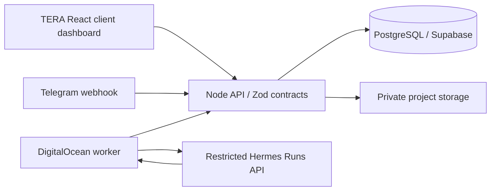

# TERA Architect

A blank, reusable client workspace for **land development, architecture, interior design and custom furniture**. Start with one discipline or combine any of the four in one scope, estimate, delivery plan and client proposal.

This is a separate edition of [TERA](https://github.com/eyeamxela/tera), forked from `bc87dccf9fd383ea60d72349d3a2f7ed0a8b55f3`. It does not update the original TERA repository or published demonstration site. The copied Sites deployment ID has been removed.

## Run locally

Requires Node 22.13+ and npm.

```bash
npm ci
npm run dev:all
```

Open [localhost:3010](http://localhost:3010). Choose **Morgan · Owner** in the local test login. The workspace starts with **zero projects**, no client data, no priced estimates and no sample property. Create a project and choose its starting template. The example accounts demonstrate roles; they are not real users and local sign-in is disabled in production mode.

The UI uses port **3010**, the API **4312**. Drafts, files and the local share-signing secret persist in ignored `.build-local/`. Stop both processes with Ctrl+C. Local client links only work while this local server is reachable; they are not internet deployments.

## The workflow

1. Choose Architecture, Interior design, Custom furniture, Land development, or Whole project. Toggle disciplines inside **Plan & investment** to create any combination. Disabled disciplines stay saved in the private draft and are removed from the published proposal data.
2. Write each brief and add its space, room, piece or work-area schedule. Numeric measurements have labeled units. Blank measurements remain unknown; specification quantities do not automatically become priced takeoffs.
3. In **Investment**, edit the suggested estimate packages, quantities, units, rates, price basis and quote references. Exclude unused packages. Add an explicit project budget, contingency and tax if applicable. There are no market-rate defaults.
4. In **Delivery**, enter earliest start, lead time, work duration and discipline dependencies. Independent work can overlap. Record responsible people and deliverable review status. Lead time begins after dependencies finish; completion is calculated from the actual entered sequence.
5. Use **Site check / Site & plans** for the retained land workflow. Use **Scope of work** to upload drawings, renders, samples or PDFs and select which files accompany the proposal. That view also holds common work packages, counted separately from discipline estimates.
6. An owner publishes a frozen revision and receives a stable client link. Missing included prices, quote references or schedule assumptions prevent publication. Publishing sends no email or Telegram message.
7. Clients see selected briefs, room/piece schedules, cost breakdowns, delivery, aerials where applicable, attached visuals and client-visible updates. Invited clients can comment, approve the scope or request changes. Later edits stay in the draft until republished; earlier revisions remain available.

The proposal has a browser **Print / save PDF** action. Generated drawings, render generation, native CAD/BIM editing and print-layout certification are not implemented. Upload visual deliverables prepared by the project team.

## Estimate rules

- Currency is USD. Each priced line is `quantity × rate`; rates and line totals are rounded to cents. Zero is an explicit price, while `null` means unpriced.
- Selected discipline costs, selected calibrated land work and common work enter the subtotal once. Bespoke furniture should be excluded from the interiors/architecture allowances when separately scoped in Furniture.
- Tax applies only to marked discipline lines. Common and mapped lines are treated as tax-inclusive; enter any tax adjustment explicitly. Applicability is a project-team decision, not a tax engine.
- Contingency applies once to the scope subtotal before tax. It does not compound on tax. Total investment is subtotal + entered tax + contingency.
- A budget shortfall stays visible. The software does not silently remove unaffordable work. Toggle a discipline or exclude specific lines to compare alternatives, then review the resulting scope with the client.
- Schedules use relative weeks. This edition does not promise booked contractor dates, stage-level cash flow, financial ROI, asset appreciation, code compliance or legal buildable area.

See [research and design decisions](docs/ARCHITECT-RESEARCH.md), the [complete variable catalog](docs/DESIGN-VARIABLES.md), and [validation status](VALIDATION.md).

## Stack and hosting



- **Frontend:** React 19, TypeScript, Vinext/Vite and the inherited Sites/Cloudflare Worker adapter. Mobile layouts are included. This repository is not yet a Vercel adapter.
- **Application:** Node HTTP API, strict Zod commands, organization/project permissions, versioned drafts, immutable proposal snapshots and durable action receipts.
- **Local database:** PGlite with persistent local storage. **Production adapter:** PostgreSQL, Supabase email authentication/private storage.
- **Agent integration:** Telegram capture, durable inbox, leased worker and a restricted Hermes Runs adapter are inherited. The new `designScope` object passes through the same validated draft contract, so UI and agent edits use one backend. Hermes can propose edits; it cannot publish or approve a scope.
- **GitHub:** source and CI, not the customer database. Runtime secrets, `.build-local/`, uploads and build output are excluded.

No Vercel project, DigitalOcean droplet, live database, Telegram bot or Hermes service is provisioned by this fork. To choose Vercel later, replace the Cloudflare-specific frontend proxy/runtime adapter, configure server-only API credentials, and test authentication and client links on the deployed domain. The backend can run on a droplet independently of that frontend choice.

The inherited [production beta specification](PRODUCTION-BETA-SPEC.md) and `deploy/` files describe the backend setup. Those files are base-system references; the discipline, estimate and schedule behavior in this README and `docs/` supersedes their original general/land-only planner. Deploy this edition with dedicated credentials and a separate database/workspace from the original beta.

## Retained land capabilities

Ventura County parcel/address/zoning lookups and USGS terrain references remain available, with calibrated work areas and optional GDAL/QGIS exports. Coverage is regional, not a nationwide parcel service. GIS acreage, zoning layers and contour imagery are reference data; they do not establish title, setbacks, permit approval or a survey-grade construction envelope. Land cost packages cover work outside mapped items; do not price the same work twice.

## Verification and source map

```bash
npm run check
npm test
npm run build
```

- `app/design-model.ts`: fields, templates, quantities, selected-scope totals and dependency schedule
- `app/design-workbench.tsx`, `app/design.css`: modular planner and responsive layout
- `app/architect-proposal.tsx`: client document and attached visual presentation
- `server/design-schema.ts`, `server/contracts.ts`: validated draft and assistant contract
- `server/service.ts`: permissions, publication and removal of unselected draft content
- `tests/design.test.mjs`: all combinations, pricing, dependencies, privacy, persistence and revisions

Local startup is blank. Automated regression tests explicitly request the original seeded fixtures in temporary databases. Do not point tests at a production database.
